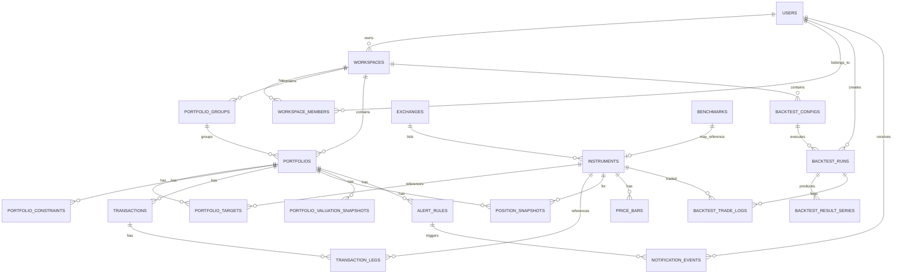

# Database Schema

> **Portfolio Manager App** 데이터베이스 설계 문서  
> Database: PostgreSQL 16+

---

## 📋 목차

1. [ERD](#-erd-entity-relationship-diagram)
2. [테이블 개요](#-테이블-개요)
3. [핵심 테이블 상세](#-핵심-테이블-상세)
4. [인덱스 전략](#-인덱스-전략)
5. [마이그레이션](#-마이그레이션)
6. [데이터 타입 규칙](#-데이터-타입-규칙)
7. [엔티티 관계](#-엔티티-관계)

---

## 📊 ERD (Entity Relationship Diagram)

### Core Domain (사용자, 워크스페이스, 포트폴리오)



---

## 📋 테이블 개요

### 사용자 및 워크스페이스 (6개)

| 테이블 | 설명 | 레코드 예상 |
|--------|------|------------|
| `users` | 사용자 계정 | ~10K |
| `workspaces` | 워크스페이스 (다중 사용자 지원) | ~10K |
| `workspace_members` | 워크스페이스 멤버십 | ~50K |
| `portfolio_groups` | 포트폴리오 그룹 | ~50K |
| `alert_rules` | 알림 규칙 | ~100K |
| `notification_events` | 알림 이벤트 | ~1M+ |

### 포트폴리오 (4개)

| 테이블 | 설명 | 레코드 예상 |
|--------|------|------------|
| `portfolios` | 포트폴리오 | ~100K |
| `portfolio_targets` | 목표 비중 설정 | ~500K |
| `portfolio_constraints` | 포트폴리오 제약 조건 | ~100K |
| `portfolio_valuation_snapshots` | 포트폴리오 평가 스냅샷 | ~10M+ |

### 금융상품 및 가격 (6개)

| 테이블 | 설명 | 레코드 예상 |
|--------|------|------------|
| `exchanges` | 거래소 | ~100 |
| `instruments` | 금융상품 (주식, ETF, 채권 등) | ~100K |
| `instrument_identifiers` | 금융상품 식별자 (ISIN, CUSIP 등) | ~200K |
| `price_bars` | EOD 가격 데이터 | ~100M+ |
| `fx_rates` | 환율 데이터 | ~10M+ |
| `benchmarks` | 벤치마크 지수 | ~100 |

### 거래 및 포지션 (4개)

| 테이블 | 설명 | 레코드 예상 |
|--------|------|------------|
| `transactions` | 거래 | ~10M |
| `transaction_legs` | 거래 레그 (복식부기) | ~30M |
| `position_snapshots` | 포지션 스냅샷 | ~50M+ |

### 백테스트 (4개)

| 테이블 | 설명 | 레코드 예상 |
|--------|------|------------|
| `backtest_configs` | 백테스트 설정 | ~10K |
| `backtest_runs` | 백테스트 실행 | ~50K |
| `backtest_result_series` | 백테스트 결과 시계열 | ~10M+ |
| `backtest_trade_logs` | 백테스트 거래 로그 | ~50M+ |

**총 테이블 수:** 24개

---

## 🔍 핵심 테이블 상세

### 1. users (사용자)

**목적:** 사용자 계정 관리

```sql
CREATE TABLE users (
    id VARCHAR(36) PRIMARY KEY,
    email VARCHAR(255) NOT NULL UNIQUE,
    password_hash VARCHAR(255),
    display_name VARCHAR(100),
    locale VARCHAR(10) DEFAULT 'ko-KR',
    created_at TIMESTAMP NOT NULL DEFAULT CURRENT_TIMESTAMP,
    updated_at TIMESTAMP NOT NULL DEFAULT CURRENT_TIMESTAMP,
    deleted_at TIMESTAMP
);

CREATE INDEX idx_users_email ON users(email);
```

**주요 필드:**
- `id` - UUID (Primary Key)
- `email` - 로그인 이메일 (유니크)
- `password_hash` - BCrypt 해시
- `display_name` - 사용자 표시 이름
- `locale` - 언어/지역 (ko-KR, en-US)
- `deleted_at` - 소프트 삭제 시각

**특징:**
- 소프트 삭제 지원 (`deleted_at`)
- 이메일로 빠른 조회 (인덱스)

---

### 2. workspaces (워크스페이스)

**목적:** 포트폴리오 그룹화 및 다중 사용자 지원

```sql
CREATE TABLE workspaces (
    id VARCHAR(36) PRIMARY KEY,
    owner_user_id VARCHAR(36) NOT NULL REFERENCES users(id),
    name VARCHAR(100) NOT NULL,
    created_at TIMESTAMP NOT NULL DEFAULT CURRENT_TIMESTAMP
);
```

**주요 필드:**
- `owner_user_id` - 소유자 (Foreign Key → users)
- `name` - 워크스페이스 이름

**특징:**
- 사용자 회원가입 시 자동으로 `{displayName}의 워크스페이스` 생성
- 향후 팀/조직 기능 확장 가능

---

### 3. portfolios (포트폴리오)

**목적:** 포트폴리오 메타데이터 및 설정

```sql
CREATE TABLE portfolios (
    id VARCHAR(36) PRIMARY KEY,
    workspace_id VARCHAR(36) NOT NULL REFERENCES workspaces(id),
    group_id VARCHAR(36) REFERENCES portfolio_groups(id),
    name VARCHAR(100) NOT NULL,
    description TEXT,
    base_currency CHAR(3) NOT NULL DEFAULT 'KRW',
    type VARCHAR(20) NOT NULL CHECK (type IN ('REAL', 'HYPOTHETICAL', 'BACKTEST_ONLY')),
    tags JSONB DEFAULT '[]',
    created_at TIMESTAMP NOT NULL DEFAULT CURRENT_TIMESTAMP,
    updated_at TIMESTAMP NOT NULL DEFAULT CURRENT_TIMESTAMP,
    archived_at TIMESTAMP
);

CREATE INDEX idx_portfolios_workspace ON portfolios(workspace_id);
CREATE INDEX idx_portfolios_group ON portfolios(group_id);
```

**주요 필드:**
- `base_currency` - 기준 통화 (ISO 4217)
- `type` - 포트폴리오 유형
  - `REAL` - 실제 계좌
  - `HYPOTHETICAL` - 가상 포트폴리오
  - `BACKTEST_ONLY` - 백테스트 전용
- `tags` - JSONB 배열 (유연한 태깅)
- `archived_at` - 소프트 삭제 시각

**특징:**
- 워크스페이스별 포트폴리오 분리
- 그룹으로 분류 가능
- 소프트 삭제 지원

---

### 4. portfolio_targets (포트폴리오 목표 비중)

**목적:** 포트폴리오의 목표 자산 배분

```sql
CREATE TABLE portfolio_targets (
    id VARCHAR(36) PRIMARY KEY,
    portfolio_id VARCHAR(36) NOT NULL REFERENCES portfolios(id) ON DELETE CASCADE,
    instrument_id VARCHAR(36),
    asset_class VARCHAR(20) NOT NULL CHECK (asset_class IN ('EQUITY', 'BOND', 'COMMODITY', 'CASH', 'ALT')),
    currency CHAR(3),
    target_weight DECIMAL(7, 4) NOT NULL CHECK (target_weight >= 0 AND target_weight <= 1),
    min_weight DECIMAL(7, 4),
    max_weight DECIMAL(7, 4),
    updated_at TIMESTAMP NOT NULL DEFAULT CURRENT_TIMESTAMP,
    UNIQUE (portfolio_id, instrument_id, currency)
);

CREATE INDEX idx_portfolio_targets_portfolio ON portfolio_targets(portfolio_id);
```

**주요 필드:**
- `instrument_id` - 금융상품 ID (NULL이면 현금)
- `asset_class` - 자산 클래스
- `currency` - 통화 (현금 타겟용)
- `target_weight` - 목표 비중 (0.0 ~ 1.0)
- `min_weight` / `max_weight` - 리밸런싱 밴드

**특징:**
- 포트폴리오 삭제 시 CASCADE
- 종목당 하나의 타겟만 허용 (UNIQUE 제약)
- 비중 합계는 애플리케이션에서 검증 (1.0 ± 0.0005)

---

### 5. instruments (금융상품)

**목적:** 주식, ETF, 채권 등 금융상품 마스터 데이터

```sql
CREATE TABLE instruments (
    id VARCHAR(36) PRIMARY KEY,
    instrument_type VARCHAR(20) NOT NULL CHECK (instrument_type IN ('STOCK', 'ETF', 'ETN', 'BOND', 'COMMODITY_INDEX', 'CASH_PROXY')),
    name VARCHAR(200) NOT NULL,
    ticker VARCHAR(20),
    exchange_id VARCHAR(36) REFERENCES exchanges(id),
    currency CHAR(3) NOT NULL,
    country CHAR(2),
    asset_class VARCHAR(20) NOT NULL CHECK (asset_class IN ('EQUITY', 'BOND', 'COMMODITY', 'CASH', 'ALT')),
    sector VARCHAR(100),
    industry VARCHAR(100),
    provider VARCHAR(100),
    expense_ratio DECIMAL(6, 4),
    benchmark_index VARCHAR(100),
    status VARCHAR(20) NOT NULL DEFAULT 'ACTIVE' CHECK (status IN ('ACTIVE', 'DELISTED')),
    first_listed_at DATE,
    delisted_at DATE
);

CREATE INDEX idx_instruments_ticker ON instruments(ticker);
CREATE INDEX idx_instruments_asset_class ON instruments(asset_class);
CREATE INDEX idx_instruments_status ON instruments(status);
```

**주요 필드:**
- `instrument_type` - 금융상품 유형
- `ticker` - 티커 심볼 (예: AAPL, VOO)
- `asset_class` - 자산 클래스
- `sector` / `industry` - 섹터/산업 (주식용)
- `provider` - ETF 운용사 (예: Vanguard)
- `expense_ratio` - 비용 비율 (ETF)
- `status` - ACTIVE / DELISTED

**특징:**
- 거래소 연결 (Foreign Key → exchanges)
- 티커, 자산 클래스, 상태로 빠른 검색 (인덱스)
- 상폐 종목 히스토리 유지

---

### 6. transactions (거래)

**목적:** 포트폴리오 거래 기록

```sql
CREATE TABLE transactions (
    id VARCHAR(36) PRIMARY KEY,
    portfolio_id VARCHAR(36) NOT NULL REFERENCES portfolios(id),
    occurred_at TIMESTAMP NOT NULL,
    settle_date DATE,
    type VARCHAR(20) NOT NULL CHECK (type IN ('BUY', 'SELL', 'DIVIDEND', 'INTEREST', 'FEE', 'TAX', 'DEPOSIT', 'WITHDRAW', 'FX_CONVERT', 'SPLIT', 'MERGER', 'TRANSFER')),
    status VARCHAR(20) NOT NULL DEFAULT 'POSTED' CHECK (status IN ('POSTED', 'VOID', 'PENDING')),
    note TEXT,
    tags JSONB DEFAULT '[]',
    created_at TIMESTAMP NOT NULL DEFAULT CURRENT_TIMESTAMP,
    updated_at TIMESTAMP NOT NULL DEFAULT CURRENT_TIMESTAMP
);

CREATE INDEX idx_transactions_portfolio_occurred ON transactions(portfolio_id, occurred_at);
CREATE INDEX idx_transactions_status ON transactions(status);
```

**주요 필드:**
- `occurred_at` - 거래 발생 시각
- `settle_date` - 결제일
- `type` - 거래 유형 (매수, 매도, 배당, 입금 등)
- `status` - 상태 (POSTED, VOID, PENDING)

**특징:**
- 복합 인덱스로 포트폴리오별 시계열 조회 최적화
- 거래 취소는 VOID 상태로 (삭제하지 않음)

---

### 7. transaction_legs (거래 레그)

**목적:** 복식부기 스타일 거래 상세 (Legs)

```sql
CREATE TABLE transaction_legs (
    id VARCHAR(36) PRIMARY KEY,
    transaction_id VARCHAR(36) NOT NULL REFERENCES transactions(id) ON DELETE CASCADE,
    leg_type VARCHAR(20) NOT NULL CHECK (leg_type IN ('ASSET', 'CASH', 'FEE', 'TAX', 'INCOME', 'FX')),
    instrument_id VARCHAR(36) REFERENCES instruments(id),
    currency CHAR(3) NOT NULL,
    quantity DECIMAL(18, 8),
    price DECIMAL(18, 6),
    amount DECIMAL(18, 4) NOT NULL,
    fx_rate_to_base DECIMAL(18, 8),
    account VARCHAR(50)
);

CREATE INDEX idx_transaction_legs_transaction ON transaction_legs(transaction_id);
```

**주요 필드:**
- `leg_type` - Leg 유형
  - `ASSET` - 자산 증감
  - `CASH` - 현금 증감
  - `FEE` - 수수료
  - `TAX` - 세금
  - `INCOME` - 수입 (배당, 이자)
  - `FX` - 환전
- `quantity` - 수량 (자산용)
- `price` - 가격 (자산용)
- `amount` - 금액 (양수/음수)
- `fx_rate_to_base` - 기준 통화 환율

**특징:**
- 거래당 다중 Legs (복식부기)
- Legs 합계는 0이어야 함 (애플리케이션 검증)
- 거래 삭제 시 CASCADE

**예제: 매수 거래**
```
Transaction: BUY AAPL 10주 @ $150
  Leg 1: ASSET   +10주 AAPL    (+$1,500)
  Leg 2: CASH    -$1,500       (-$1,500)
  Leg 3: FEE     -$1           (-$1)
  ----------------------------------------
  합계: 0
```

---

### 8. price_bars (가격 데이터)

**목적:** EOD (End-of-Day) 가격 히스토리

```sql
CREATE TABLE price_bars (
    instrument_id VARCHAR(36) NOT NULL REFERENCES instruments(id),
    timeframe VARCHAR(5) NOT NULL CHECK (timeframe IN ('D1', 'W1', 'M1')),
    ts DATE NOT NULL,
    open DECIMAL(18, 6) NOT NULL,
    high DECIMAL(18, 6) NOT NULL,
    low DECIMAL(18, 6) NOT NULL,
    close DECIMAL(18, 6) NOT NULL,
    adj_close DECIMAL(18, 6),
    volume BIGINT,
    data_vendor VARCHAR(50),
    PRIMARY KEY (instrument_id, timeframe, ts)
);

CREATE INDEX idx_price_bars_ts ON price_bars(instrument_id, ts);
```

**주요 필드:**
- `timeframe` - D1 (일봉), W1 (주봉), M1 (월봉)
- `ts` - 시계열 날짜
- OHLC - Open, High, Low, Close
- `adj_close` - 조정 종가 (배당, 스플릿 반영)
- `data_vendor` - 데이터 출처

**특징:**
- 복합 Primary Key (종목, 타임프레임, 날짜)
- 대용량 데이터 (향후 파티셔닝 필요)
- 성과 분석, 백테스트에 사용

---

### 9. position_snapshots (포지션 스냅샷)

**목적:** 특정 시점의 포지션 상태 (빠른 조회용)

```sql
CREATE TABLE position_snapshots (
    portfolio_id VARCHAR(36) NOT NULL REFERENCES portfolios(id),
    as_of TIMESTAMP NOT NULL,
    instrument_id VARCHAR(36) NOT NULL REFERENCES instruments(id),
    quantity DECIMAL(18, 8) NOT NULL,
    avg_cost DECIMAL(18, 6),
    market_value_base DECIMAL(18, 4),
    unrealized_pnl_base DECIMAL(18, 4),
    realized_pnl_base DECIMAL(18, 4),
    PRIMARY KEY (portfolio_id, as_of, instrument_id)
);

CREATE INDEX idx_position_snapshots_as_of ON position_snapshots(portfolio_id, as_of);
```

**주요 필드:**
- `as_of` - 스냅샷 시각
- `quantity` - 보유 수량
- `avg_cost` - 평균 단가
- `market_value_base` - 기준 통화 시장가치
- `unrealized_pnl_base` - 미실현 손익
- `realized_pnl_base` - 실현 손익

**특징:**
- 매일 EOD 스냅샷 저장 (스케줄러)
- 거래 이력 재계산 없이 빠른 조회
- 대용량 테이블 (파티셔닝 필요)

---

### 10. backtest_runs (백테스트 실행)

**목적:** 백테스트 실행 및 상태 추적

```sql
CREATE TABLE backtest_runs (
    id VARCHAR(36) PRIMARY KEY,
    config_id VARCHAR(36) NOT NULL REFERENCES backtest_configs(id),
    created_by VARCHAR(36) NOT NULL REFERENCES users(id),
    status VARCHAR(20) NOT NULL CHECK (status IN ('RUNNING', 'SUCCEEDED', 'FAILED')),
    started_at TIMESTAMP NOT NULL DEFAULT CURRENT_TIMESTAMP,
    finished_at TIMESTAMP,
    error_message TEXT
);

CREATE INDEX idx_backtest_runs_config ON backtest_runs(config_id);
CREATE INDEX idx_backtest_runs_status ON backtest_runs(status);
```

**주요 필드:**
- `status` - RUNNING, SUCCEEDED, FAILED
- `started_at` / `finished_at` - 실행 시간
- `error_message` - 실패 시 오류 메시지

**특징:**
- RabbitMQ 비동기 처리
- 상태별 조회 최적화 (인덱스)

---

## 🚀 인덱스 전략

### 단일 컬럼 인덱스

```sql
-- 사용자
CREATE INDEX idx_users_email ON users(email);

-- 금융상품
CREATE INDEX idx_instruments_ticker ON instruments(ticker);
CREATE INDEX idx_instruments_asset_class ON instruments(asset_class);
CREATE INDEX idx_instruments_status ON instruments(status);

-- 거래
CREATE INDEX idx_transactions_status ON transactions(status);
CREATE INDEX idx_transaction_legs_transaction ON transaction_legs(transaction_id);

-- 백테스트
CREATE INDEX idx_backtest_runs_status ON backtest_runs(status);
```

### 복합 인덱스 (성능 최적화)

```sql
-- 포트폴리오별 거래 시계열 조회
CREATE INDEX idx_transactions_portfolio_occurred ON transactions(portfolio_id, occurred_at);

-- 포지션 스냅샷 조회
CREATE INDEX idx_position_snapshots_as_of ON position_snapshots(portfolio_id, as_of);

-- 가격 데이터 조회
CREATE INDEX idx_price_bars_ts ON price_bars(instrument_id, ts);

-- 환율 데이터 조회
CREATE INDEX idx_fx_rates_quote_ts ON fx_rates(quote_currency, ts);
```

### Foreign Key 인덱스

```sql
CREATE INDEX idx_portfolios_workspace ON portfolios(workspace_id);
CREATE INDEX idx_portfolios_group ON portfolios(group_id);
CREATE INDEX idx_portfolio_targets_portfolio ON portfolio_targets(portfolio_id);
CREATE INDEX idx_backtest_runs_config ON backtest_runs(config_id);
CREATE INDEX idx_backtest_trade_logs_run ON backtest_trade_logs(run_id, ts);
CREATE INDEX idx_notification_events_user ON notification_events(user_id, created_at);
```

### 향후 추가 검토

대용량 데이터 발생 시 추가 인덱스:

```sql
-- 전체 거래 검색 (admin용)
CREATE INDEX idx_transactions_occurred_at ON transactions(occurred_at);

-- 종목별 포지션 조회
CREATE INDEX idx_position_snapshots_instrument ON position_snapshots(instrument_id, as_of);

-- 포트폴리오 평가 시계열
CREATE INDEX idx_portfolio_valuation_as_of ON portfolio_valuation_snapshots(as_of);
```

---

## 🔄 마이그레이션

### Flyway Migration

**마이그레이션 파일 위치:**
```
backend/src/main/resources/db/migration/
├── V1__init_schema.sql          # 초기 스키마
├── V2__add_xxx.sql              # 향후 마이그레이션
└── V3__add_yyy.sql
```

**명명 규칙:**
```
V{version}__{description}.sql

예:
V1__init_schema.sql
V2__add_valuation_tables.sql
V3__add_rebalancing_history.sql
```

### 마이그레이션 실행

```bash
# 자동 실행 (애플리케이션 시작 시)
./gradlew bootRun

# 수동 실행
./gradlew flywayMigrate

# 마이그레이션 정보 확인
./gradlew flywayInfo

# 롤백 (Pro 버전 필요)
./gradlew flywayUndo
```

### 마이그레이션 예제

**V2__add_portfolio_notes.sql:**
```sql
-- 포트폴리오에 메모 필드 추가
ALTER TABLE portfolios ADD COLUMN notes TEXT;

-- 기존 데이터 기본값 설정
UPDATE portfolios SET notes = '' WHERE notes IS NULL;
```

**V3__add_dividend_tracking.sql:**
```sql
-- 배당 추적 테이블 추가
CREATE TABLE dividend_schedules (
    id VARCHAR(36) PRIMARY KEY,
    instrument_id VARCHAR(36) NOT NULL REFERENCES instruments(id),
    ex_date DATE NOT NULL,
    pay_date DATE NOT NULL,
    amount_per_share DECIMAL(18, 6) NOT NULL,
    currency CHAR(3) NOT NULL,
    status VARCHAR(20) DEFAULT 'SCHEDULED'
);

CREATE INDEX idx_dividend_schedules_instrument ON dividend_schedules(instrument_id, ex_date);
```

---

## 📐 데이터 타입 규칙

### 문자열

| 용도 | 타입 | 예시 |
|------|------|------|
| ID (UUID) | `VARCHAR(36)` | `a1b2c3d4-...` |
| 이메일 | `VARCHAR(255)` | `user@example.com` |
| 이름 | `VARCHAR(100)` | `성장 포트폴리오` |
| 긴 텍스트 | `TEXT` | 설명, 메모 |
| 통화 코드 | `CHAR(3)` | `KRW`, `USD` |
| 국가 코드 | `CHAR(2)` | `KR`, `US` |
| ENUM | `VARCHAR(20)` | `REAL`, `EQUITY` |

### 숫자

| 용도 | 타입 | 정밀도 | 예시 |
|------|------|--------|------|
| 비중 | `DECIMAL(7, 4)` | 소수점 4자리 | `0.3500` |
| 가격 | `DECIMAL(18, 6)` | 소수점 6자리 | `150.123456` |
| 금액 | `DECIMAL(18, 4)` | 소수점 4자리 | `1000000.5000` |
| 수량 | `DECIMAL(18, 8)` | 소수점 8자리 | `10.12345678` |
| 환율 | `DECIMAL(18, 8)` | 소수점 8자리 | `1234.56789012` |
| 수익률 | `DECIMAL(10, 6)` | 소수점 6자리 | `0.123456` (12.3456%) |
| 거래량 | `BIGINT` | 정수 | `1000000` |

### 날짜/시간

| 용도 | 타입 | 예시 |
|------|------|------|
| 타임스탬프 | `TIMESTAMP` | `2026-02-06 10:30:00` |
| 날짜 | `DATE` | `2026-02-06` |
| 생성일시 | `TIMESTAMP DEFAULT CURRENT_TIMESTAMP` | 자동 설정 |

### JSONB

```sql
-- 유연한 키-값 저장
tags JSONB DEFAULT '[]'
params JSONB DEFAULT '{}'
trading_hours JSONB

-- 예제
tags: ["growth", "aggressive"]
params: {"rebalance_threshold": 0.05}
trading_hours: {"open": "09:00", "close": "15:30"}
```

---

## 🔗 엔티티 관계

### 1:N 관계

```
users          1 ──< N  workspaces
workspaces     1 ──< N  portfolios
portfolios     1 ──< N  portfolio_targets
portfolios     1 ──< N  transactions
transactions   1 ──< N  transaction_legs
instruments    1 ──< N  price_bars
portfolios     1 ──< N  position_snapshots
```

### N:M 관계

```
workspaces  N ──< workspace_members >── N  users
```

### Optional 관계

```
portfolios  N ──< 0..1  portfolio_groups
instruments N ──< 0..1  exchanges
```

### Cascade 규칙

**ON DELETE CASCADE:**
- `portfolio_targets` → `portfolios` 삭제 시 타겟도 삭제
- `transaction_legs` → `transactions` 삭제 시 Legs도 삭제
- `backtest_result_series` → `backtest_runs` 삭제 시 결과도 삭제

**Foreign Key 제약 유지:**
- `portfolios.workspace_id` → 워크스페이스 삭제 시 포트폴리오 보호
- `transactions.portfolio_id` → 포트폴리오 삭제 시 거래 보호

---

## 🎯 데이터 무결성 규칙

### CHECK 제약

```sql
-- 비중은 0.0 ~ 1.0
CHECK (target_weight >= 0 AND target_weight <= 1)

-- 거래 상태
CHECK (status IN ('POSTED', 'VOID', 'PENDING'))

-- 자산 클래스
CHECK (asset_class IN ('EQUITY', 'BOND', 'COMMODITY', 'CASH', 'ALT'))
```

### UNIQUE 제약

```sql
-- 이메일 중복 방지
UNIQUE (email)

-- 포트폴리오당 종목별 하나의 타겟만
UNIQUE (portfolio_id, instrument_id, currency)

-- 가격 데이터 중복 방지
PRIMARY KEY (instrument_id, timeframe, ts)
```

### NOT NULL 제약

```sql
-- 필수 필드
email VARCHAR(255) NOT NULL
base_currency CHAR(3) NOT NULL
occurred_at TIMESTAMP NOT NULL
```

---

## 📊 테이블 크기 예상 (1년 후)

| 테이블 | 레코드 수 | 예상 크기 |
|--------|----------|----------|
| `users` | 10K | 1 MB |
| `portfolios` | 100K | 10 MB |
| `transactions` | 10M | 1 GB |
| `transaction_legs` | 30M | 3 GB |
| `price_bars` | 100M | 10 GB |
| `position_snapshots` | 50M | 5 GB |
| `backtest_result_series` | 10M | 1 GB |
| **Total** | ~200M | **~30 GB** |

**성능 최적화 시점:**
- 테이블 크기 > 10GB → 파티셔닝 검토
- 쿼리 속도 저하 → 인덱스 추가 또는 쿼리 최적화
- 스냅샷 테이블 → 오래된 데이터 아카이브

---

## 🔧 성능 최적화 전략

### 1. 파티셔닝 (향후)

**시계열 데이터 파티셔닝:**

```sql
-- 월별 파티셔닝 (price_bars)
CREATE TABLE price_bars_2026_01 PARTITION OF price_bars
    FOR VALUES FROM ('2026-01-01') TO ('2026-02-01');

CREATE TABLE price_bars_2026_02 PARTITION OF price_bars
    FOR VALUES FROM ('2026-02-01') TO ('2026-03-01');
```

**적용 대상:**
- `price_bars` (가격 데이터)
- `position_snapshots` (포지션 스냅샷)
- `backtest_result_series` (백테스트 결과)

---

### 2. 인덱스 유지보수

```sql
-- 인덱스 재구축 (주기적)
REINDEX TABLE transactions;

-- 통계 업데이트
ANALYZE transactions;

-- 인덱스 사용 현황 확인
SELECT schemaname, tablename, indexname, idx_scan
FROM pg_stat_user_indexes
ORDER BY idx_scan ASC;
```

---

### 3. 쿼리 최적화

**N+1 문제 해결:**
```java
// Bad: N+1 쿼리
List<Portfolio> portfolios = portfolioRepository.findAll();
portfolios.forEach(p -> p.getTargets().size()); // 추가 쿼리 발생

// Good: JOIN FETCH
@Query("SELECT p FROM Portfolio p LEFT JOIN FETCH p.targets WHERE p.workspaceId = :workspaceId")
List<Portfolio> findAllWithTargets(@Param("workspaceId") String workspaceId);
```

**복잡한 집계는 jOOQ 사용:**
```java
// jOOQ로 성과 분석 쿼리
DSL.select(
    PORTFOLIO_VALUATION_SNAPSHOTS.AS_OF,
    PORTFOLIO_VALUATION_SNAPSHOTS.TOTAL_MARKET_VALUE_BASE
)
.from(PORTFOLIO_VALUATION_SNAPSHOTS)
.where(PORTFOLIO_VALUATION_SNAPSHOTS.PORTFOLIO_ID.eq(portfolioId))
.orderBy(PORTFOLIO_VALUATION_SNAPSHOTS.AS_OF.asc())
.fetch();
```

---

## 📝 참고사항

### Connection Pool 설정

```yaml
spring:
  datasource:
    hikari:
      maximum-pool-size: 20
      minimum-idle: 5
      connection-timeout: 30000
      idle-timeout: 600000
      max-lifetime: 1800000
```

### 트랜잭션 격리 수준

```java
@Transactional(isolation = Isolation.READ_COMMITTED)
public void createTransaction(...) {
    // 기본 격리 수준: READ_COMMITTED
}
```

---

## 🔄 변경 이력

### v1.0.0 (Current)
- 초기 스키마 (24개 테이블)
- 사용자, 워크스페이스, 포트폴리오
- 거래, 포지션, 백테스트
- 가격 데이터, 알림

---

**문서 버전:** 1.0.0  
**최종 업데이트:** 2026-02-06  
**스키마 버전:** V1  

**관련 문서:**
- [API Reference](API.md)
- [개발 워크플로우](DEVELOPMENT_WORKFLOW.md)
- [마이그레이션 파일](../backend/src/main/resources/db/migration/)

---

<div align="center">

**DB 스키마 관련 질문은 이슈로 등록해주세요** 💬

**[⬆️ 맨 위로](#database-schema)**

</div>
